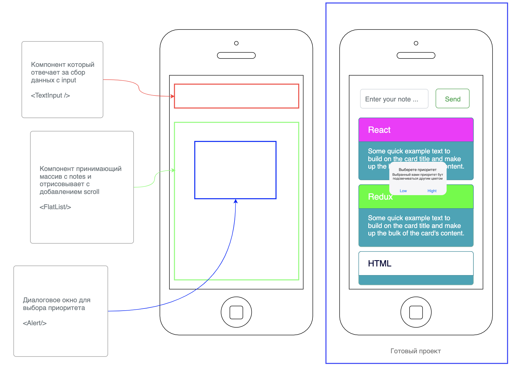

# Домашнее задание 1

Создание планировщика, возможность создать заметку и выставить ей приоритет в зависимости
от сложности выполнения, все компоненты должны быть функциональными

## Шаг 1
- Создай репозиторий в котором нужно создать папку `todo`
- Создать проект используя expo init < название вашего проекта >
- Установить зависимости для работы с Expo

## Шаг 2
- Запустите проект на симуляторе IOS и эмуляторе Android ( если есть такая возможность )
- Очисти базовую сборку от лишнего кода

## Шаг 3
- Создай компоненты:
  - Компонент который содержит возможность ввода данных, используй TextInput для сбора данных
    - Принимает введенные данные в форму и и сохраняет в State
  - Компонент принимает массив заметок и последовательно их отрисовывает
    - При нажатии по элементу появляется модальное окно с возможностью удаления элемента
      по которому кликнули, для этого используй onLongPress
  ( последняя добавленная заметка должна быть вверху списка ) для перебора используй FlatList
  - Модальное окно в котором можно выбрать приоритет заметки, используй Alert 
  
## Стилизация компонентов на по вашему желанию

