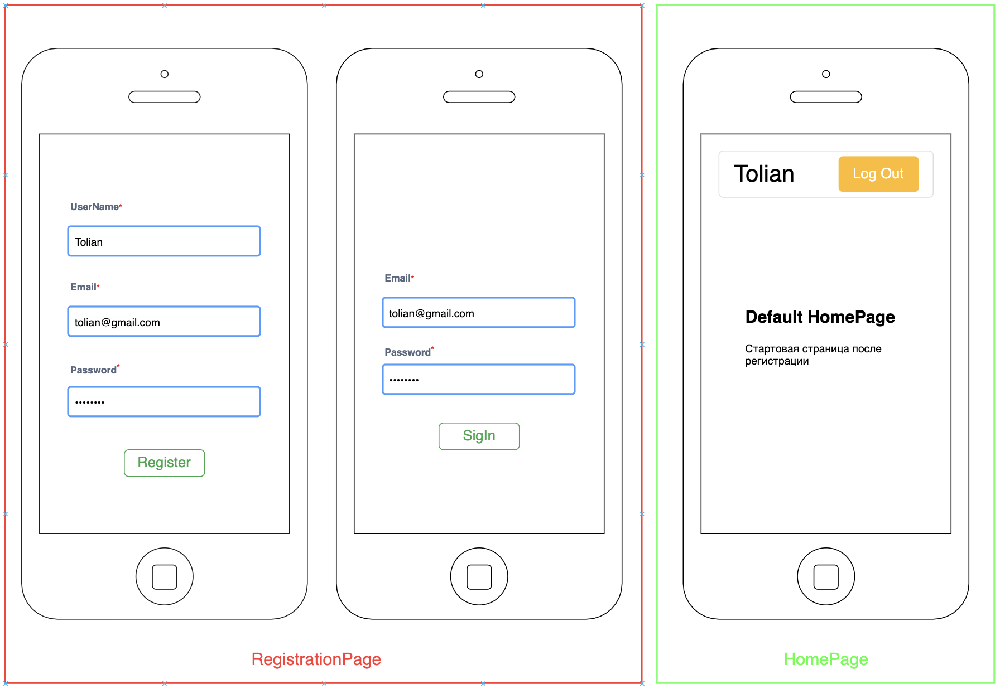
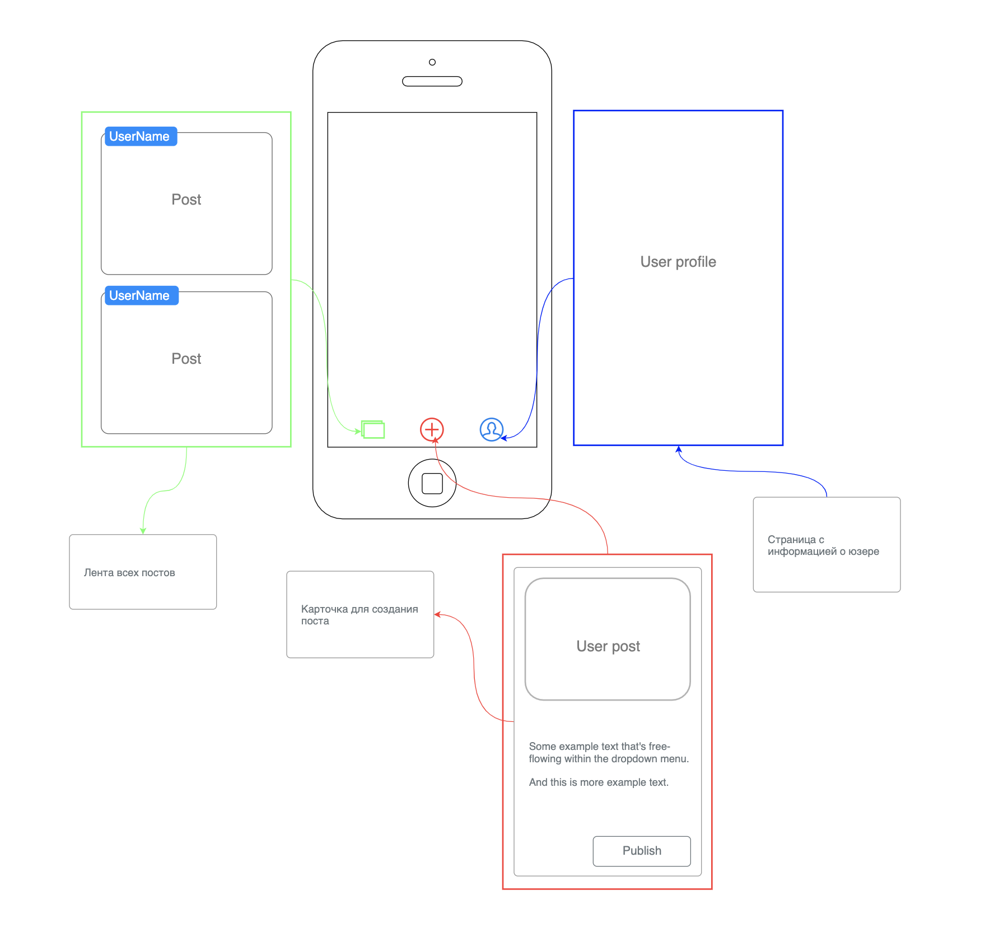

# Домашнее задание 2

В этом задании нужно создать форму регистрации с возможностью переключения между входом/регистрацией и корневым компонентом
в котором находятся 3 доступных экрана ( < HomePage />, < CreatePage />, < ProfilePage /> ) которые доступны после
входа в приложение



Создай новую папку в которую установи все зависимости ( так же как вы это делали в первом домашнем задании )


- После успешной базовой сборки, установи все для работы с Expo
- Для переключения экранов установи react-navigation
  - Не забудь про stack и bottom-tabs для создания навигации
- Все компоненты должны быть функциональными, для этого используем hooks
- Формы регистрации должны быть рабочими и выводить значения с input
  - Переключения между формами должно работать и для этого используем navigaiton.navigate( и stack
  на который должен перенаправлять )
- Используем функцию useRouter( true/false ) которая рендерит два состояния, основывается на получении данных от сервера
и пускает внутрь приложения для имитации ответа от сервера подставля флаг true или false
- Для стилизации нижней навигации добавь Icons и используй ionicons




```
// router
const useRouter = isAuthentication => {
  if (isAuthentication) {
    return (
     // будет доступно после успешной регистрации
    );
  }

  return (
   // авторизация 
  );
};
```

# Стилизация компонентов по вашему желанию
